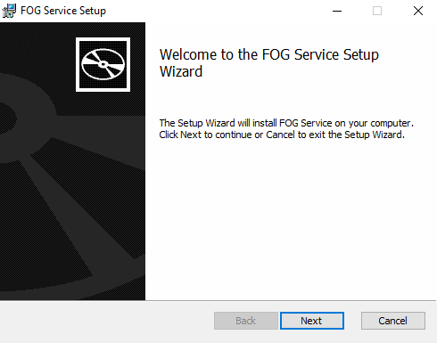
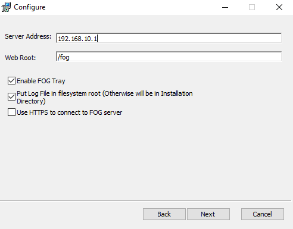
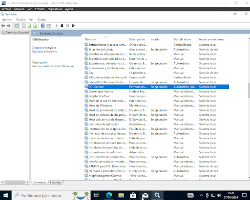

# Documentació Projecte FOG amb MKDocs

Aquest es el meu ficher mkdocs amb el que fare la documentacio de la instal·lacio, configuració i funcionament del meu servidor FOG

## Instal·lacio

Primer que tot a la maquina servidor li posem un adaptador en mode pont i un amb red interna
 

Configurem la red interna per a que la IP sigui estatica

Quan tinguem la red ben feta descarregem el fog de la pagina oficial

Llavors descomprimim l’arxiu

Com utilitzem ubuntu, la opcio que hem de escollir es la dos:

Seleccionarem el tipus d'instal·lació normal, canviarem la interfície de xarxa per defecte per la nova que hem configurat i li indicarem com a DHCP la direcció de la nostra xarxa interna.

Confirmem que tot el que hem seleccionat es correcte i continuem

Despres de tota la instal·lacio ens sortira on hem de anar per a entrar de forma grafica:

Completem la instal·lacio desde l’adreça

Despres de la instal·lacio web podem premer enter a la terminal per a acabar la instal·lacio del fog desde terminal

Despres de la instal·lacio ens donara les credencials per a poder entrar al fog

Accedim al fog:

## Creacio de imatges
El que farem a continuacio sera crear les imatges windows:

Per a la de windows al apartat de Image Type seleccionarem Multiple Partition Image Single
Disk.

Afegim el client windows desde hosts i create new hosts

Despres d’aixo a List All hosts podem veure la maquina que hem creat
Llavors farem clic a la incona groga per a que ens fase la copia de la imatge del windows

Ara farem el mateix pero amb un Ubuntu

##Captura de client windows
Ara iniciarem la maquina windows

Entrarem en mode LAN

Despres de la carga de la imatge windows podem comprobar com s’ha pasat correctament al veure quan pesa la imatge del windows 10

##Captura de client ubuntu

Farem com en windows i entrarem en mode lan per a pujar la imatge del ubuntu

##Instalar imatge windows

Per a instalar la imatge agafem una maquina verge (sense iso) i entrem en mode lan per a que obrigue el fog

Pero abans de iniciar-la es important recordar posar la red en interna i registrar la maquina com a host

Anem a l’opcio de deploy image per a pasar-li la imatge del windows 10

I instalem el windows 10

Aqui es pot veure com son les mateixes maquines despres de la instalacio amb la imatge

##Llançar un paquet d'instal·lacio als clients
Primer el que haurem de fer per al windows es instalar el client de fog

Comprobem que esta en execucio el servei

Instalem el paquet al servidor i creem l’Snapin

Entrem dins del client desde el fog i dins dels snapins anyadirem el que acabem de crear

Despres anem a tasques i single snapin

Llavors seleccionem el snapin i li donem a task

Llavors hem de anar a tasques i esperar

M’he adonat de que esta fent alguna cosa extranya, perque en teoria esta instal·lant el mozila firefox de forma correcta pero no veig que s’instali a la maquina client

